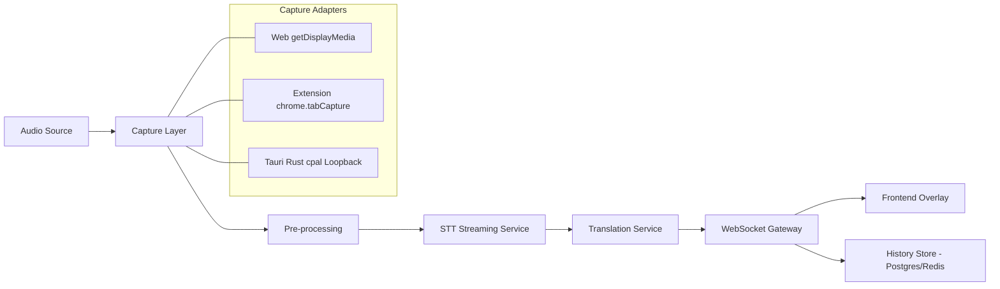
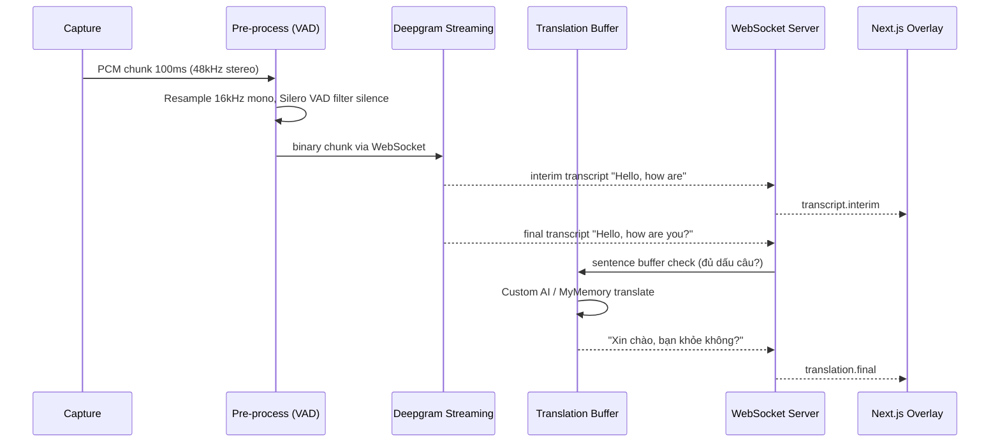

# Kiến Trúc Live Translate

## 1. Mục tiêu & Yêu cầu

**Chức năng:**
- **Phase 1 (Foundation):** Bắt bất kỳ audio nào phát ra từ máy tính (browser, Youtube, Spotify, Zoom, file local). Hiển thị Live Caption tiếng Anh (interim + final) + dịch song song sang tiếng Việt, độ trễ < 1.5s.
- **Phase 2 (Đa ngôn ngữ):** Cho phép user tùy chọn `Source Language` (ngôn ngữ caption) và `Target Language` (ngôn ngữ dịch) bất kỳ, hỗ trợ auto-detect. Hỗ trợ multi-target (1 nguồn dịch ra 2-3 đích song song).
- **Phase 3 (AI):** Từ transcript live sinh `Realtime Summary`, `Action Items`, `Keywords/Chapters`, `Q&A` trên transcript.

**Phi chức năng:**
- Độ trễ: < 800ms cho interim, < 1500ms cho final + translation.
- Độ chính xác: WER < 12% cho EN (Deepgram Nova-3 ~ 9%).
- Chi phí: < $0.005/phút.
- Privacy: không lưu audio mặc định.

## 2. Tại sao Pure Web App không đủ

Browser chạy trong sandbox, `Web Audio API` và `MediaDevices` chỉ cho phép:

- `getUserMedia({audio:true})` -> Mic
- `getDisplayMedia({audio:true})` -> Audio của Tab/Window mà user chủ động Share (có picker). Không bắt được audio nền, không bắt được app ngoài browser.

=> Cần lớp Native hoặc Extension để vượt sandbox. Xem so sánh ở `README.md: So sánh 3 kiến trúc`.

**Quyết định:** Xây Core xử lý ở `apps/server` (WebSocket), 3 Capture Adapter cùng bắn về 1 interface. Frontend không cần biết nguồn audio từ đâu.

## 3. Kiến trúc tổng quan

### 3.1 Sơ đồ Component



### 3.2 Luồng dữ liệu (Sequence)



## 4. Chi tiết từng Service

### 4.1 Capture Layer (`apps/web`, `apps/extension`, `apps/desktop`)

| Adapter | API | Format gửi đi | Ghi chú |
|---------|-----|---------------|---------|
| Web | `navigator.mediaDevices.getDisplayMedia({audio:true, video:true})` + `UrlIframePlayer` | WebM/PCM | Iframe `allow="microphone; camera; display-capture"` full quyền, audio iframe cũng là tab audio |
| Web Speech FREE | `webkitSpeechRecognition` + `getDisplayMedia`/`tabCapture` track | Text (on-device) | `audioSource=mic` (mic) hoặc `tab` (kể cả iframe) - web thường `start(track)` không hỗ trợ nên fallback PCM Deepgram, Side Panel extension thì `start(track)` được |
| Extension Side Panel | `chrome.tabCapture.getMediaStreamId({targetTabId})` -> `getUserMedia({chromeMediaSource:'tab', chromeMediaSourceId})` | PCM 16k (Deepgram) hoặc Text (Web Speech track) | `sidepanel.js` bắt tab hiện tại (kể cả iframe), loopback `AudioContext.destination` để vẫn nghe, broadcast `room=default` về web UI |
| Tauri | Rust `cpal` + `coreaudio` (macOS) / `wasapi` (Windows) loopback | PCM 48kHz stereo | Bắt được toàn bộ system audio, cần xin quyền Screen Recording trên macOS |

Tất cả đều chuyển về `AudioWorklet` để trích PCM và gửi qua WebSocket `binaryType: arraybuffer`.

### 4.2 Pre-processing Service

Vị trí: có thể chạy ở Client (giảm bandwidth 60%) hoặc Server (đỡ tốn CPU client). Khuyên: **Client-side**.

- **Resample:** `libsamplerate` hoặc `OfflineAudioContext` về `16kHz, 16bit, mono` - chuẩn cho mọi STT.
- **VAD:** `Silero VAD (ONNX, ~1MB)` chạy trong `Worklet` hoặc `WASM`. Ngưỡng 0.5, cắt chunk im lặng > 300ms không gửi.
- **Chunking:** 100-300ms/chunk. Chunk quá nhỏ -> tốn overhead, quá to -> tăng trễ.

Code tham chiếu:
- `apps/web/src/audio/worklet.ts` (sẽ tạo)
- `apps/server/src/audio/vad.py`

### 4.3 STT Service (`apps/server/src/stt/`)

**Lựa chọn:**

1.  **Cloud Streaming (khuyên cho Phase 1-2):**
    - `Deepgram Nova-3` : `wss://api.deepgram.com/v1/listen?model=nova-3&interim_results=true&punctuate=true&diarize=false&language=${sourceLang}` hoặc `detect_language=true` cho auto-detect
    - `Azure Speech` : `wss://.../speech/recognition/conversation/cognitiveservices/v1?language=${sourceLang}` (hỗ trợ 75+ ngôn ngữ)
    - Ưu: độ trễ thấp, có interim, tự xử lý punctuation, hỗ trợ đa ngôn ngữ sẵn.
    - Nhược: cost, phụ thuộc mạng.

2.  **Self-host:**
    - `faster-whisper large-v3-turbo` + `CTranslate2` chạy trên GPU T4, hỗ trợ auto-detect 90+ ngôn ngữ.
    - Cần tự implement streaming: dùng `buffer 1s + sliding window + VAD` để giả streaming. Trễ ~1.2-2s.

**Phase 2 - Đa ngôn ngữ:**

- Thêm `Language Router`: `STT lang` là param động từ `user_settings.sourceLang`. Nếu `sourceLang=auto` -> bật `detect_language`.
- Trả về thêm `detectedLanguage` + `confidence` để UI hiện "Đang nghe: JA (92%)".
- Lưu `language` vào `STTResult.language` để Translation biết nguồn.

**Interface chuẩn hóa:**

```typescript
// packages/shared/src/types.ts
type STTResult = {
  type: 'interim' | 'final';
  transcript: string;
  language: string; // 'en' | 'ja' | 'vi' | 'auto'
  confidence: number;
  is_eos: boolean; // end of sentence
  words: { word: string; start: number; end: number }[];
}
```

Server là proxy + room broadcast: nhận PCM + `sourceLang` từ client -> forward tới Deepgram/Custom -> normalize -> `_broadcast(roomId)` tới mọi client trong `default` room (extension + web cùng thấy) `apps/server/src/main.py:13`.

### 4.4 Translation Service (`apps/server/src/translate/`)

**Vấn đề:** Không dịch `interim` word-by-word, kết quả rất giật và sai ngữ pháp.

**Giải pháp: Sentence Buffer (có hỗ trợ đa ngôn ngữ)**

```typescript
// apps/server/src/translate/buffer.ts
class SentenceBuffer {
  buffer = "";
  onFinalTranscript(text: string, sourceLang: string) {
    this.buffer += text + " ";
    // Với EN/VI/FR dùng punctuation [.?!], với JA/ZH dùng pause + độ dài
    const sentences = isPunctuationLang(sourceLang) 
      ? splitByPunctuation(this.buffer) 
      : splitByPause(this.buffer, 700);
    if (sentences.complete.length > 0) {
      translate(sentences.complete, sourceLang, targetLang); // fan-out nếu multi-target
      this.buffer = sentences.remainder;
    }
  }
}
```

**Provider:**

- FREE: `MyMemory` (`api.mymemory.translated.net`) - không cần key, ~5000 ký tự/ngày/IP, cache `Map`+`Redis`, fallback `LibreTranslate`. Đủ cho demo/test.
- AI chất lượng cao: `Custom OpenAI-compatible` (`CUSTOM_API_KEY/BASE_URL/MODEL` - Ollama, OpenRouter, Groq, Together, vLLM...) - prompt:
  ```
  You are a live caption translator. Translate from ${sourceLang} to ${targetLang}, keep context, short and natural, no explanation.
  ```
  Hỗ trợ streaming (`TRANSLATE_STREAM=1`), giữ ngữ cảnh tốt hơn cho ngôn ngữ hiếm.

**Phase 2 - Đa ngôn ngữ:**

- API đổi thành `translate(text, sourceLang, targetLang)`, cache key `${sourceLang}:${targetLang}:${hash(text)}`.
- Hỗ trợ `multi-target`: `Promise.all(targetLangs.map(t => translate(text, sourceLang, t)))`.
- Thêm bảng `supported_languages` sync từ provider.

Cache: `Map<enSentence, viSentence>` + `Redis` nếu scale.

### 4.5 Frontend (`apps/web/src/`)

- **State:** `Zustand` store `captionStore: { interimText, finalSegments[], translations: Record<targetLang, string>, sourceLang, targetLangs[] }`
- **Kết nối:** `socket.io-client` với `reconnect + heartbeat`, gửi `sourceLang/targetLangs` khi handshake.
- **UI:** Overlay kiểu Youtube:
  - Dòng 1: Source language (trắng, opacity 0.7 cho interim, 1.0 cho final) + badge "JA 92%"
  - Dòng 2+: Target language(s) (vàng cho VI, xanh cho EN...) - hỗ trợ 1-3 dòng dịch song song
  - `LanguageSelector` dropdown chọn nguồn/đích, `SummaryPanel` cho Phase 3
  - Controls: font size, opacity, position, pause, clear, export .srt
- **History:** `IndexedDB (dexie)` cho local, `Postgres` cho cloud sync (optional). Thêm `pgvector` cho semantic search ở Phase 3+.

### 4.5.1 AI Service (Phase 3) `apps/server/src/ai/`

- Chạy song song với Translation, không chặn luồng live. Buffer transcript theo window 30s-5 phút.
- Gọi `Custom LLM` (`CUSTOM_API_KEY/BASE_URL/MODEL` - OpenAI-compatible) để sinh `summary`, `actionItems`, `keywords`, `chapters`.
- Stream về UI qua `ws event: summary.chunk`, lưu vào table `summaries`. Nếu thiếu `CUSTOM_*` sẽ fallback heuristic.

### 4.6 Persistence

- MVP: chỉ `IndexedDB` + `localStorage`.
- Product: `Postgres` (transcript history) + `Redis` (pub/sub, cache translation, rate limit).
- Không lưu blob audio, chỉ lưu `transcript` nếu user opt-in.

## 5. Hạ tầng & Triển khai

- **Monorepo:** `pnpm + Turborepo` để share `packages/shared`.
- **Container:** `Dockerfile` cho `apps/server` (Python 3.11 + ffmpeg + faster-whisper).
- **Deploy:**
  - Frontend: `Vercel` (Edge).
  - Backend: `Fly.io` (có GPU `a10` rẻ) hoặc `Railway`/`Render`. Cần `WebSocket` sticky session.
  - Extension: `Chrome Web Store`.
  - Desktop: `Tauri updater` + `GitHub Release`.
- **Env:** `apps/server/.env` chứa `DEEPGRAM_API_KEY` (STT), `CUSTOM_API_KEY/BASE_URL/MODEL` (AI translate + summary). Không cần `GOOGLE/GEMINI/OPENAI` riêng.

## 6. Bảo mật & Quyền riêng tư

- Xin quyền `microphone / displayMedia` với UI giải thích rõ.
- Audio chỉ stream qua `wss://`, không lưu server trừ khi user bật `Save history`.
- CSP, CORS chặt cho WebSocket.
- Trên macOS Tauri cần `NSMicrophoneUsageDescription`.

## 7. Trade-offs đã chốt

- Chọn `WebSocket` thay vì `WebRTC`: đơn giản, đủ cho 1-1 streaming, dễ proxy tới STT provider.
- Chọn `Sentence Buffer` thay vì `real-time word translate`: chất lượng dịch cao hơn, chấp nhận trễ thêm 300ms.
- Chọn `Deepgram` làm default thay vì Whisper self-host: time-to-market nhanh, fallback được.

## 8. Cấu trúc thư mục cụ thể (sẽ scaffold)

```
live-translate/
├── apps/
│   ├── web/                          # Next.js 15 (App Router)
│   │   ├── app/
│   │   │   ├── page.tsx              # Overlay chính: caption + language selector
│   │   │   ├── history/page.tsx      # Lịch sử + semantic search
│   │   │   └── layout.tsx
│   │   ├── components/
│   │   │   ├── CaptionOverlay.tsx    # 2-4 dòng EN/VI/JA, interim opacity 0.7
│   │   │   ├── LanguageSelector.tsx  # Source/Target dropdown, auto-detect toggle
│   │   │   ├── UrlIframePlayer.tsx   # URL -> iframe allow="microphone; camera; display-capture" full quyền
│   │   │   ├── STTProviderSelector.tsx # deepgram | webspeech (mic/tab) | free
│   │   │   ├── TranslateProviderSelector.tsx # ai (CUSTOM) | mymemory FREE
│   │   │   ├── SummaryPanel.tsx      # Phase 3: realtime summary
│   │   │   └── Controls.tsx          # font, opacity, pause, export
│   │   ├── lib/
│   │   │   ├── socket.ts             # socket.io-client, reconnect, heartbeat, roomId default
│   │   │   └── store.ts              # Zustand captionStore
│   │   ├── audio/
│   │   │   ├── worklet.ts            # AudioWorklet: resample 16kHz
│   │   │   ├── webSpeech.ts          # Web Speech + captureTabAudioForWebSpeech (tab/iframe)
│   │   │   ├── vad.wasm              # Silero VAD WASM
│   │   │   └── capture.ts            # getDisplayMedia wrapper
│   │   └── hooks/useLiveCaption.ts   # audioSource mic|tab, fallback PCM khi web track không hỗ trợ
│   ├── extension/                    # Chrome MV3 Side Panel
│   │   ├── manifest.json             # sidePanel + tabCapture
│   │   ├── background.js             # getMediaStreamId
│   │   ├── sidepanel.html/js/css     # tabCapture -> Web Speech track + broadcast room
│   │   └── permission.html/js        # mic permission helper
│   ├── desktop/                      # Tauri 2 + Rust
│   │   ├── src-tauri/
│   │   │   ├── src/audio.rs          # cpal loopback (CoreAudio/WASAPI)
│   │   │   └── Cargo.toml
│   │   └── src/                      # reuse apps/web build
│   └── server/                       # FastAPI (Python 3.11)
│       ├── src/
│       │   ├── main.py               # FastAPI + socket.io
│       │   ├── ws/gateway.py         # WebSocket handler, room management
│       │   ├── stt/
│       │   │   ├── base.py           # STTProvider interface
│       │   │   ├── deepgram.py       # wss proxy -> Deepgram
│       │   │   ├── azure.py          # fallback
│       │   │   └── whisper.py        # self-host faster-whisper
│       │   ├── translate/
│       │   │   ├── buffer.py         # SentenceBuffer đa ngôn ngữ
│       │   │   ├── free.py           # MyMemory FREE + LibreTranslate fallback
│       │   │   └── llm.py            # Custom OpenAI-compatible (CUSTOM_*)
│       │   ├── ai/
│       │   │   └── summarizer.py     # Phase 3: window 30s-5m (Custom LLM)
│       │   └── db/models.py
│       ├── Dockerfile
│       └── .env.example
├── packages/shared/
│   ├── src/
│   │   ├── types.ts                  # STTResult, TranslationResult, WS Events
│   │   ├── languages.ts              # SUPPORTED_LANGUAGES, isPunctuationLang()
│   │   └── buffer.ts                 # share SentenceBuffer logic
│   └── package.json
├── docker-compose.yml                # postgres + redis + server
└── .github/workflows/ci.yml
```

## 9. Protocol cụ thể

### 9.1 WebSocket Events (Socket.io)

Client -> Server:
```typescript
// handshake
socket.emit('join', { roomId: string, sourceLang: 'en'|'ja'|'auto', targetLangs: ['vi','en'], userId })
// audio binary
socket.emit('audio:chunk', ArrayBuffer) // PCM 16kHz mono, 250ms, ~8KB
socket.emit('audio:stop')
socket.emit('settings:update', { sourceLang, targetLangs })
socket.emit('summary:request', { sessionId, window: '30s'|'full' }) // Phase 3
```

Server -> Client:
```typescript
socket.on('stt:interim', { transcript: string, language: string, confidence: number })
socket.on('stt:final',   { transcript: string, language: string, words: Word[], is_eos: boolean })
socket.on('translate:final', { source: string, targetLang: string, text: string })
socket.on('translate:stream', { targetLang: string, token: string }) // nếu dùng LLM
socket.on('summary:chunk', { token: string }) // Phase 3
socket.on('summary:final', { summary: string, chapters: Chapter[], actionItems: string[] })
socket.on('error', { code: 'STT_429'|'TRANSLATE_ERROR', message })
```

### 9.2 REST (cho history & settings)

```
GET  /api/sessions?userId=xxx          # list sessions
GET  /api/sessions/:id/transcripts     # transcript + translations
POST /api/sessions/:id/summary         # trigger summary on-demand
GET  /api/languages                    # supported source/target matrix
```

## 10. Database Schema (Postgres + pgvector cho Phase 3)

```sql
-- users (hoặc dùng Clerk/Supabase Auth)
CREATE TABLE users (id UUID PRIMARY KEY, email TEXT, created_at TIMESTAMPTZ);

CREATE TABLE sessions (
  id UUID PRIMARY KEY,
  user_id UUID REFERENCES users(id),
  source_lang TEXT NOT NULL, -- 'en', 'ja', 'auto'
  target_langs TEXT[] NOT NULL, -- '{vi,ja}'
  stt_provider TEXT, -- 'deepgram'
  started_at TIMESTAMPTZ, ended_at TIMESTAMPTZ
);

CREATE TABLE transcripts (
  id UUID PRIMARY KEY,
  session_id UUID REFERENCES sessions(id),
  seq INT, -- thứ tự
  type TEXT, -- 'interim'|'final' (chỉ lưu final)
  text TEXT NOT NULL,
  language TEXT,
  confidence REAL,
  start_ms INT, end_ms INT,
  created_at TIMESTAMPTZ DEFAULT now(),
  embedding VECTOR(1536) -- pgvector cho semantic search (Phase 3)
);

CREATE TABLE translations (
  id UUID PRIMARY KEY,
  transcript_id UUID REFERENCES transcripts(id),
  target_lang TEXT NOT NULL,
  text TEXT NOT NULL,
  provider TEXT, -- 'mymemory'|'llm' (custom)
  created_at TIMESTAMPTZ
);

CREATE TABLE summaries (
  id UUID PRIMARY KEY,
  session_id UUID REFERENCES sessions(id),
  window_start_ms INT, window_end_ms INT,
  content TEXT, -- markdown
  chapters JSONB, -- [{title, start_ms}]
  action_items JSONB,
  model TEXT, -- 'custom' = CUSTOM_MODEL
  created_at TIMESTAMPTZ
);
-- Redis: cache translate `${src}:${tgt}:${hash}`, rate limit, pub/sub room
```

## 11. Latency Budget & Provider Abstraction

**Budget end-to-end 1.5s:**

| Chặng | Thời gian | Ghi chú |
|-------|-----------|---------|
| Capture + Worklet | 50ms | AudioWorklet buffer 128 samples |
| VAD + Resample | 20ms | WASM |
| Network WS -> Server | 30-80ms | tùy region, chọn Fly.io gần user |
| STT interim | 300-500ms | Deepgram streaming |
| Sentence Buffer | 0-700ms | đợi dấu câu/pause, trung bình 300ms |
| Translate | 150-300ms | MyMemory 150-200ms, Custom LLM 300ms streaming |
| WS -> UI render | 30ms | |
| **Tổng** | **~900-1300ms** | |

**Provider Abstraction:**

```typescript
// apps/server/src/stt/base.py
class STTProvider(ABC):
  async def connect(self, lang: str): ...
  async def send_pcm(self, chunk: bytes): ...
  async def on_result(self) -> STTResult: ... // yield interim/final

// apps/server/src/translate/base.py
class TranslateProvider(ABC):
  async def translate(self, text: str, src: str, tgt: str) -> str: ...
  async def translate_stream(self, text: str, src: str, tgt: str) -> AsyncIterator[str]: ...
```

Server chọn provider qua env: `STT_PROVIDER=deepgram|whisper|webspeech` và `TRANSLATE_PROVIDER=ai|free`, fallback `Custom -> MyMemory` khi 429/lỗi.

## 12. Triển khai & Env

**docker-compose.yml:**
```yaml
services:
  postgres: { image: pgvector/pgvector:pg16, ports: ["5432:5432"] }
  redis: { image: redis:7-alpine, ports: ["6379:6379"] }
  server: { build: ./apps/server, ports: ["8000:8000"], env_file: .env }
```

**.env.example:**
```
DEEPGRAM_API_KEY=dg_...
CUSTOM_API_KEY=...        # cho AI translate + summary (OpenAI-compatible)
CUSTOM_BASE_URL=...       # vd https://api.openai.com/v1 hoặc http://localhost:11434/v1
CUSTOM_MODEL=gpt-4o-mini
DATABASE_URL=postgres://...
REDIS_URL=redis://localhost:6379
STT_PROVIDER=deepgram      # deepgram | webspeech | whisper
TRANSLATE_PROVIDER=auto    # auto | ai (custom) | free (MyMemory)
```

**Deploy:**
- Web: `Vercel` (Next.js), env `NEXT_PUBLIC_WS_URL=wss://api.live-translate.fly.dev`
- Server: `Fly.io` với `fly.toml` scale 1-3 instances, sticky session qua `fly-replay` hoặc Redis pub/sub để broadcast cross-instance.
- Extension: `pnpm build:extension` -> zip -> Chrome Web Store.
- Desktop: `pnpm tauri build` -> GitHub Release + updater.

