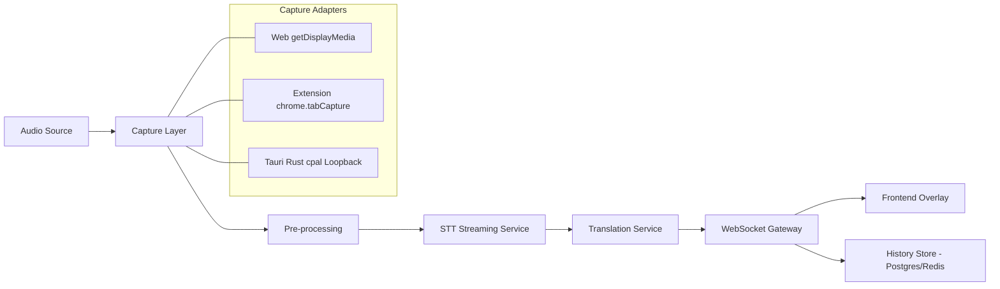
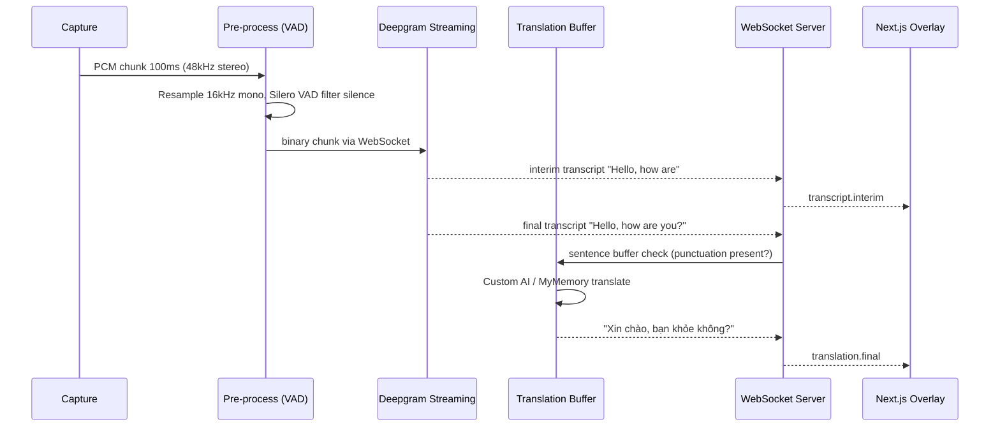

# Live Translate Architecture

## 1. Goals & Requirements

**Functional:**
- **Phase 1 (Foundation):** Capture any audio playing on the computer (browser, YouTube, Spotify, Zoom, local files). Display live English captions (interim + final) and translate in parallel to Vietnamese with latency < 1.5s.
- **Phase 2 (Multi-language):** Allow users to choose any `Source Language` (caption language) and `Target Language` (translation language), with auto-detect support. Support multi-target (1 source translated to 2-3 targets in parallel).
- **Phase 3 (AI):** Generate `Realtime Summary`, `Action Items`, `Keywords/Chapters`, and `Q&A` from live transcripts.

**Non-functional:**
- Latency: < 800ms for interim, < 1500ms for final + translation.
- Accuracy: WER < 12% for EN (Deepgram Nova-3 ~ 9%).
- Cost: < $0.005/minute.
- Privacy: no audio stored by default.

## 2. Why Pure Web App Is Not Enough

Browsers run in a sandbox. `Web Audio API` and `MediaDevices` only allow:

- `getUserMedia({audio:true})` -> Microphone
- `getDisplayMedia({audio:true})` -> Audio from a Tab/Window that the user explicitly shares (via picker). Cannot capture background audio or audio from apps outside the browser.

=> A native layer or extension is required to escape the sandbox. See comparison in `README.md`.

**Decision:** Build core processing in `apps/server` (WebSocket) with 3 Capture Adapters feeding into a single interface. The frontend does not need to know where the audio comes from.

## 3. High-Level Architecture

### 3.1 Component Diagram



### 3.2 Data Flow (Sequence)



## 4. Service Details

### 4.1 Capture Layer (`apps/web`, `apps/extension`, `apps/desktop`)

| Adapter | API | Format | Notes |
|---------|-----|--------|-------|
| Web | `navigator.mediaDevices.getDisplayMedia({audio:true, video:true})` + `UrlIframePlayer` | WebM/PCM | Iframe `allow="microphone; camera; display-capture"` with full permissions, iframe audio is also tab audio |
| Web Speech FREE | `webkitSpeechRecognition` + `getDisplayMedia`/`tabCapture` track | Text (on-device) | `audioSource=mic` (mic) or `tab` (including iframe) - web `start(track)` is typically unsupported so it falls back to PCM Deepgram; Side Panel extension supports `start(track)` |
| Extension Side Panel | `chrome.tabCapture.getMediaStreamId({targetTabId})` -> `getUserMedia({chromeMediaSource:'tab', chromeMediaSourceId})` | PCM 16k (Deepgram) or Text (Web Speech track) | `sidepanel.js` captures current tab (including iframe), loopback `AudioContext.destination` so audio remains audible, broadcasts `room=default` to web UI |
| Tauri | Rust `cpal` + `coreaudio` (macOS) / `wasapi` (Windows) loopback | PCM 48kHz stereo | Captures all system audio, requires Screen Recording permission on macOS |

All adapters pipe through `AudioWorklet` to extract PCM and send via WebSocket `binaryType: arraybuffer`.

### 4.2 Pre-processing Service

Location: can run on Client (reduces bandwidth by 60%) or Server (saves client CPU). Recommended: **Client-side**.

- **Resample:** `libsamplerate` or `OfflineAudioContext` to `16kHz, 16bit, mono` - standard for all STT providers.
- **VAD:** `Silero VAD (ONNX, ~1MB)` running in `Worklet` or `WASM`. Threshold 0.5, drop silent chunks > 300ms.
- **Chunking:** 100-300ms/chunk. Too small -> overhead, too large -> higher latency.

Reference code:
- `apps/web/src/audio/worklet.ts` (to be created)
- `apps/server/src/audio/vad.py`

### 4.3 STT Service (`apps/server/src/stt/`)

**Options:**

1.  **Cloud Streaming (recommended for Phase 1-2):**
    - `Deepgram Nova-3` : `wss://api.deepgram.com/v1/listen?model=nova-3&interim_results=true&punctuate=true&diarize=false&language=${sourceLang}` or `detect_language=true` for auto-detect
    - `Azure Speech` : `wss://.../speech/recognition/conversation/cognitiveservices/v1?language=${sourceLang}` (supports 75+ languages)
    - Pros: low latency, interim results, automatic punctuation, built-in multi-language support.
    - Cons: cost, network dependency.

2.  **Self-hosted:**
    - `faster-whisper large-v3-turbo` + `CTranslate2` running on T4 GPU, supports auto-detect for 90+ languages.
    - Requires custom streaming implementation: `1s buffer + sliding window + VAD` to simulate streaming. Latency ~1.2-2s.

**Phase 2 - Multi-language:**

- Add `Language Router`: `STT lang` is a dynamic param from `user_settings.sourceLang`. If `sourceLang=auto` -> enable `detect_language`.
- Return additional `detectedLanguage` + `confidence` for UI to display "Listening: JA (92%)".
- Store `language` in `STTResult.language` so Translation knows the source.

**Standardized Interface:**

```typescript
// packages/shared/src/types.ts
type STTResult = {
  type: 'interim' | 'final';
  transcript: string;
  language: string; // 'en' | 'ja' | 'vi' | 'auto'
  confidence: number;
  is_eos: boolean; // end of sentence
  words: { word: string; start: number; end: number }[];
}
```

The server acts as a proxy + room broadcaster: receives PCM + `sourceLang` from client -> forwards to Deepgram/Custom -> normalizes -> `_broadcast(roomId)` to all clients in the `default` room (extension + web share the same view) `apps/server/src/main.py:13`.

### 4.4 Translation Service (`apps/server/src/translate/`)

**Problem:** Translating `interim` word-by-word produces jittery and grammatically incorrect results.

**Solution: Sentence Buffer (with multi-language support)**

```typescript
// apps/server/src/translate/buffer.ts
class SentenceBuffer {
  buffer = "";
  onFinalTranscript(text: string, sourceLang: string) {
    this.buffer += text + " ";
    // For EN/VI/FR use punctuation [.?!], for JA/ZH use pause + length
    const sentences = isPunctuationLang(sourceLang) 
      ? splitByPunctuation(this.buffer) 
      : splitByPause(this.buffer, 700);
    if (sentences.complete.length > 0) {
      translate(sentences.complete, sourceLang, targetLang); // fan-out if multi-target
      this.buffer = sentences.remainder;
    }
  }
}
```

**Provider & seq-mapped guarantee:**

- FREE: `MyMemory` (`api.mymemory.translated.net`) - no key required, ~5000 chars/day/IP, `Map`+`Redis` cache, `LibreTranslate` fallback. Sufficient for demo/testing.
- High-quality AI: `Custom OpenAI-compatible` (`CUSTOM_API_KEY/BASE_URL/MODEL` - Ollama, OpenRouter, Groq, Together, vLLM...) - prompt:
  ```
  You are a live caption translator. Translate from ${sourceLang} to ${targetLang}, keep context, short and natural, no explanation.
  ```
  Supports streaming (`TRANSLATE_STREAM=1`), better context preservation for rare languages.
- **Seq mapping (fix for slow/out-of-order AI):** Server assigns monotonic `seq` for each sentence from `SentenceBuffer` (`Session._sentence_seq`), emits `translate:final {seq, source, text}` and `stt:final {seq}` for Web Speech. Client `useLiveCaption` stores `sentences[seq]=source` and `translations[lang][seq]=text` (sparse array), `CaptionOverlay` & history render by `seq` so translations stay aligned even with slow/out-of-order AI responses.

**Phase 2 - Multi-language:**

- API becomes `translate(text, sourceLang, targetLang)`, cache key `${sourceLang}:${targetLang}:${hash(text)}`.
- Supports `multi-target`: `Promise.all(targetLangs.map(t => translate(text, sourceLang, t)))`.
- Add `supported_languages` table synced from provider.

Cache: `Map<enSentence, viSentence>` + `Redis` if scaling.

### 4.5 Frontend (`apps/web/src/`)

- **State:** `Zustand` store `captionStore: { interimText, finalSegments[], translations: Record<targetLang, string>, sourceLang, targetLangs[] }`
- **Connection:** `socket.io-client` with `reconnect + heartbeat`, sending `sourceLang/targetLangs` on handshake.
- **UI:** YouTube-style overlay:
  - Line 1: Source language (white, opacity 0.7 for interim, 1.0 for final) + badge "JA 92%"
  - Line 2+: Target language(s) (yellow for VI, blue for EN...) - supports 1-3 parallel translation lines
  - `LanguageSelector` dropdown for source/target, `SummaryPanel` for Phase 3
  - Controls: font size, opacity, position, pause, clear, export .srt
- **History:** `IndexedDB (dexie)` for local, `Postgres` for cloud sync (optional). Add `pgvector` for semantic search in Phase 3+.

### 4.5.1 AI Service (Phase 3) `apps/server/src/ai/`

- Runs in parallel with Translation, does not block the live pipeline. Buffers transcript in 30s-5 minute windows.
- Calls `Custom LLM` (`CUSTOM_API_KEY/BASE_URL/MODEL` - OpenAI-compatible) to generate `summary`, `actionItems`, `keywords`, `chapters`.
- Streams to UI via `ws event: summary.chunk`, stores in `summaries` table. Falls back to heuristic if `CUSTOM_*` is missing.

### 4.6 Persistence

- MVP: `IndexedDB` + `localStorage` only.
- Production: `Postgres` (transcript history) + `Redis` (pub/sub, translation cache, rate limiting).
- Do not store audio blobs, only store `transcript` if user opts in.

## 5. Infrastructure & Deployment

- **Monorepo:** `pnpm + Turborepo` to share `packages/shared`.
- **Container:** `Dockerfile` for `apps/server` (Python 3.11 + ffmpeg + faster-whisper).
- **Deploy:**
  - Frontend: `Vercel` (Edge).
  - Backend: `Fly.io` (with cheap `a10` GPU) or `Railway`/`Render`. Requires `WebSocket` sticky sessions.
  - Extension: `Chrome Web Store`.
  - Desktop: `Tauri updater` + `GitHub Release`.
- **Env:** `apps/server/.env` contains `DEEPGRAM_API_KEY` (STT), `CUSTOM_API_KEY/BASE_URL/MODEL` (AI translate + summary). No separate `GOOGLE/GEMINI/OPENAI` key needed.

## 6. Security & Privacy

- Request `microphone / displayMedia` permission with clear explanatory UI.
- Audio streams only over `wss://`, not stored on server unless user enables `Save history`.
- Strict CSP and CORS for WebSocket.
- On macOS Tauri requires `NSMicrophoneUsageDescription`.

## 7. Trade-offs Decided

- Chose `WebSocket` over `WebRTC`: simpler, sufficient for 1-1 streaming, easier to proxy to STT provider.
- Chose `Sentence Buffer` over `real-time word translate`: higher translation quality, accepts additional 300ms latency.
- Chose `Deepgram` as default over self-hosted Whisper: faster time-to-market, with fallback available.

## 8. Directory Structure (to be scaffolded)

```
live-translate/
├── apps/
│   ├── web/                          # Next.js 15 (App Router)
│   │   ├── app/
│   │   │   ├── page.tsx              # Main overlay: caption + language selector
│   │   │   ├── history/page.tsx      # History + semantic search
│   │   │   └── layout.tsx
│   │   ├── components/
│   │   │   ├── CaptionOverlay.tsx    # 2-4 lines EN/VI/JA, interim opacity 0.7
│   │   │   ├── LanguageSelector.tsx  # Source/Target dropdown, auto-detect toggle
│   │   │   ├── UrlIframePlayer.tsx   # URL -> iframe allow="microphone; camera; display-capture" full permissions
│   │   │   ├── STTProviderSelector.tsx # deepgram | webspeech (mic/tab) | free
│   │   │   ├── TranslateProviderSelector.tsx # ai (CUSTOM) | mymemory FREE
│   │   │   ├── SummaryPanel.tsx      # Phase 3: realtime summary
│   │   │   └── Controls.tsx          # font, opacity, pause, export
│   │   ├── lib/
│   │   │   ├── socket.ts             # socket.io-client, reconnect, heartbeat, roomId default
│   │   │   └── store.ts              # Zustand captionStore
│   │   ├── audio/
│   │   │   ├── worklet.ts            # AudioWorklet: resample 16kHz
│   │   │   ├── webSpeech.ts          # Web Speech + captureTabAudioForWebSpeech (tab/iframe)
│   │   │   ├── vad.wasm              # Silero VAD WASM
│   │   │   └── capture.ts            # getDisplayMedia wrapper
│   │   └── hooks/useLiveCaption.ts   # audioSource mic|tab, fallback PCM when web track unsupported
│   ├── extension/                    # Chrome MV3 Side Panel
│   │   ├── manifest.json             # sidePanel + tabCapture
│   │   ├── background.js             # getMediaStreamId
│   │   ├── sidepanel.html/js/css     # tabCapture -> Web Speech track + broadcast room
│   │   └── permission.html/js        # mic permission helper
│   ├── desktop/                      # Tauri 2 + Rust
│   │   ├── src-tauri/
│   │   │   ├── src/audio.rs          # cpal loopback (CoreAudio/WASAPI)
│   │   │   └── Cargo.toml
│   │   └── src/                      # reuse apps/web build
│   └── server/                       # FastAPI (Python 3.11)
│       ├── src/
│       │   ├── main.py               # FastAPI + socket.io
│       │   ├── ws/gateway.py         # WebSocket handler, room management
│       │   ├── stt/
│       │   │   ├── base.py           # STTProvider interface
│       │   │   ├── deepgram.py       # wss proxy -> Deepgram
│       │   │   ├── azure.py          # fallback
│       │   │   └── whisper.py        # self-host faster-whisper
│       │   ├── translate/
│       │   │   ├── buffer.py         # SentenceBuffer multi-language
│       │   │   ├── free.py           # MyMemory FREE + LibreTranslate fallback
│       │   │   └── llm.py            # Custom OpenAI-compatible (CUSTOM_*)
│       │   ├── ai/
│       │   │   └── summarizer.py     # Phase 3: window 30s-5m (Custom LLM)
│       │   └── db/models.py
│       ├── Dockerfile
│       └── .env.example
├── packages/shared/
│   ├── src/
│   │   ├── types.ts                  # STTResult, TranslationResult, WS Events
│   │   ├── languages.ts              # SUPPORTED_LANGUAGES, isPunctuationLang()
│   │   └── buffer.ts                 # share SentenceBuffer logic
│   └── package.json
├── docker-compose.yml                # postgres + redis + server
└── .github/workflows/ci.yml
```

## 9. Protocol Details

### 9.1 WebSocket Events (Socket.io)

Client -> Server:
```typescript
// handshake
socket.emit('join', { roomId: string, sourceLang: 'en'|'ja'|'auto', targetLangs: ['vi','en'], userId })
// audio binary
socket.emit('audio:chunk', ArrayBuffer) // PCM 16kHz mono, 250ms, ~8KB
socket.emit('audio:stop')
socket.emit('settings:update', { sourceLang, targetLangs })
socket.emit('summary:request', { sessionId, window: '30s'|'full' }) // Phase 3
```

Server -> Client:
```typescript
socket.on('stt:interim', { transcript: string, language: string, confidence: number })
socket.on('stt:final',   { transcript: string, language: string, words: Word[], is_eos: boolean })
socket.on('translate:final', { source: string, targetLang: string, text: string })
socket.on('translate:stream', { targetLang: string, token: string }) // if using LLM
socket.on('summary:chunk', { token: string }) // Phase 3
socket.on('summary:final', { summary: string, chapters: Chapter[], actionItems: string[] })
socket.on('error', { code: 'STT_429'|'TRANSLATE_ERROR', message })
```

### 9.2 REST (for history & settings)

```
GET  /api/sessions?userId=xxx          # list sessions
GET  /api/sessions/:id/transcripts     # transcript + translations
POST /api/sessions/:id/summary         # trigger summary on-demand
GET  /api/languages                    # supported source/target matrix
```

## 10. Database Schema (Postgres + pgvector for Phase 3)

```sql
-- users (or use Clerk/Supabase Auth)
CREATE TABLE users (id UUID PRIMARY KEY, email TEXT, created_at TIMESTAMPTZ);

CREATE TABLE sessions (
  id UUID PRIMARY KEY,
  user_id UUID REFERENCES users(id),
  source_lang TEXT NOT NULL, -- 'en', 'ja', 'auto'
  target_langs TEXT[] NOT NULL, -- '{vi,ja}'
  stt_provider TEXT, -- 'deepgram'
  started_at TIMESTAMPTZ, ended_at TIMESTAMPTZ
);

CREATE TABLE transcripts (
  id UUID PRIMARY KEY,
  session_id UUID REFERENCES sessions(id),
  seq INT, -- order
  type TEXT, -- 'interim'|'final' (only final stored)
  text TEXT NOT NULL,
  language TEXT,
  confidence REAL,
  start_ms INT, end_ms INT,
  created_at TIMESTAMPTZ DEFAULT now(),
  embedding VECTOR(1536) -- pgvector for semantic search (Phase 3)
);

CREATE TABLE translations (
  id UUID PRIMARY KEY,
  transcript_id UUID REFERENCES transcripts(id),
  target_lang TEXT NOT NULL,
  text TEXT NOT NULL,
  provider TEXT, -- 'mymemory'|'llm' (custom)
  created_at TIMESTAMPTZ
);

CREATE TABLE summaries (
  id UUID PRIMARY KEY,
  session_id UUID REFERENCES sessions(id),
  window_start_ms INT, window_end_ms INT,
  content TEXT, -- markdown
  chapters JSONB, -- [{title, start_ms}]
  action_items JSONB,
  model TEXT, -- 'custom' = CUSTOM_MODEL
  created_at TIMESTAMPTZ
);
-- Redis: cache translate `${src}:${tgt}:${hash}`, rate limit, pub/sub room
```

## 11. Latency Budget & Provider Abstraction

**End-to-end budget 1.5s:**

| Stage | Time | Notes |
|-------|------|-------|
| Capture + Worklet | 50ms | AudioWorklet buffer 128 samples |
| VAD + Resample | 20ms | WASM |
| Network WS -> Server | 30-80ms | depends on region, choose Fly.io near user |
| STT interim | 300-500ms | Deepgram streaming |
| Sentence Buffer | 0-700ms | wait for punctuation/pause, avg 300ms |
| Translate | 150-300ms | MyMemory 150-200ms, Custom LLM 300ms streaming |
| WS -> UI render | 30ms | |
| **Total** | **~900-1300ms** | |

**Provider Abstraction:**

```typescript
// apps/server/src/stt/base.py
class STTProvider(ABC):
  async def connect(self, lang: str): ...
  async def send_pcm(self, chunk: bytes): ...
  async def on_result(self) -> STTResult: ... // yield interim/final

// apps/server/src/translate/base.py
class TranslateProvider(ABC):
  async def translate(self, text: str, src: str, tgt: str) -> str: ...
  async def translate_stream(self, text: str, src: str, tgt: str) -> AsyncIterator[str]: ...
```

Server selects provider via env: `STT_PROVIDER=deepgram|whisper|webspeech` and `TRANSLATE_PROVIDER=ai|free`, fallback `Custom -> MyMemory` on 429/error.

## 12. Deployment & Env

**docker-compose.yml:**
```yaml
services:
  postgres: { image: pgvector/pgvector:pg16, ports: ["5432:5432"] }
  redis: { image: redis:7-alpine, ports: ["6379:6379"] }
  server: { build: ./apps/server, ports: ["8000:8000"], env_file: .env }
```

**.env.example:**
```
DEEPGRAM_API_KEY=dg_...
CUSTOM_API_KEY=...        # for AI translate + summary (OpenAI-compatible)
CUSTOM_BASE_URL=...       # e.g. https://api.openai.com/v1 or http://localhost:11434/v1
CUSTOM_MODEL=gpt-4o-mini
DATABASE_URL=postgres://...
REDIS_URL=redis://localhost:6379
STT_PROVIDER=deepgram      # deepgram | webspeech | whisper
TRANSLATE_PROVIDER=auto    # auto | ai (custom) | free (MyMemory)
```

**Deploy:**
- Web: `Vercel` (Next.js), env `NEXT_PUBLIC_WS_URL=wss://api.live-translate.fly.dev`
- Server: `Fly.io` with `fly.toml` scale 1-3 instances, sticky session via `fly-replay` or Redis pub/sub for cross-instance broadcast.
- Extension: `pnpm build:extension` -> zip -> Chrome Web Store.
- Desktop: `pnpm tauri build` -> GitHub Release + updater.
