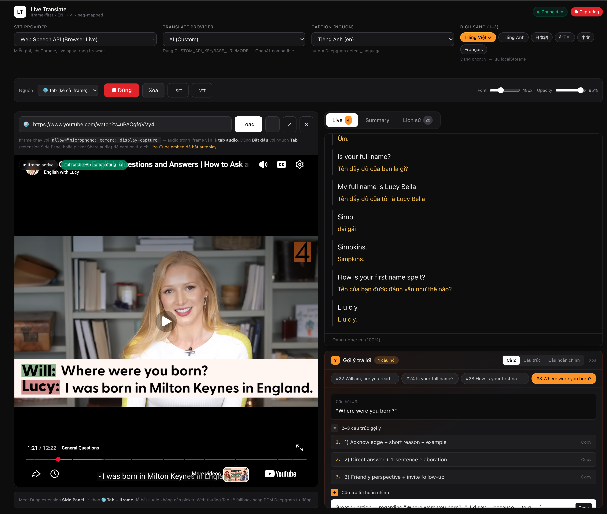

# Live Translate — Live Caption EN + Live Translate VI

Real-time web application that displays live English captions from any audio playing on your computer and translates them instantly into Vietnamese in parallel.



> **Key Constraint:** A pure Web App cannot capture `system audio` due to Browser Sandbox restrictions. This project follows the roadmap `Pure Web (POC) -> Chrome Extension -> Tauri Hybrid` sharing a single core backend.

## Architecture Overview

```
[Audio Source: Browser Tab / System / Mic]
        |
        v
[Capture Layer] -> [Pre-processing: VAD + Resample 16kHz] -> [STT Streaming] -> [Translation Buffer] -> [WebSocket] -> [Frontend Overlay]
     Web / Extension / Tauri (Rust cpal)      Silero VAD              Deepgram / faster-whisper           Custom AI (OpenAI-compat) / MyMemory FREE
```

See [ARCHITECTURE.md](./ARCHITECTURE.md) for details.

## Roadmap

| Phase | Goal | Timeline | Output |
|-------|------|----------|--------|
| 1 - Foundation | Live Caption EN + Live Translate VI (current) | 2-3 weeks | Web + Extension + Tauri (optional) + Deepgram |
| 2 - Multi-language | Any source/target language pair | 2 weeks | Language Selector + STT auto-detect + Translate matrix |
| 3 - AI Summary | Summaries, action items, keywords from transcript | 2-3 weeks | AI Service (LLM) + Summary Panel |
| 4+ - Backlog | Diarization, Custom Vocabulary, OBS, Offline... | Ongoing | See ROADMAP.md: Phase 4+ |

See [ROADMAP.md](./ROADMAP.md) for details.

## Recommended Stack 2026

- **Frontend:** Next.js 15 + TypeScript + Tailwind + Zustand + Socket.io-client
- **Backend:** FastAPI (Python) - ideal for faster-whisper, or NestJS
- **STT:** Deepgram Nova-3 (streaming, interim) | Self-host: faster-whisper large-v3-turbo | Web Speech API (FREE browser)
- **Translate:** Custom AI `CUSTOM_API_KEY/BASE_URL/MODEL` (OpenAI-compatible: Ollama/OpenRouter/Groq...) or `MyMemory FREE` (free, ~200ms)
- **AI Summary:** Custom AI with same `CUSTOM_*` (no separate GEMINI/OPENAI key required)
- **Infra:** Docker + Fly.io/Railway (GPU) + Vercel (Frontend) + Redis (queue if scaling)
- **Monorepo:** pnpm + Turborepo

```
apps/web        # Next.js - UI caption overlay + UrlIframePlayer (full allow)
apps/extension  # Chrome Extension Side Panel - tabCapture + Web Speech FREE (including iframe)
apps/desktop    # Tauri (Rust) - system loopback (CoreAudio/WASAPI) - optional
apps/server     # FastAPI - WebSocket + STT/Translate proxy (room broadcast)
packages/shared # types, utils, sentence-buffer
```

## Quick Start (after scaffolding)

```bash
# 1. Install dependencies
pnpm install

# 2. Run server (Python 3.11+)
cd apps/server
python3 -m venv .venv && source .venv/bin/activate
pip install -r requirements.txt
cp .env.example .env   # then fill in DEEPGRAM_API_KEY + CUSTOM_*
python -m src.main
# Server runs at ws://localhost:8000/ws

# 3. Run web (new terminal)
pnpm dev:web          # http://localhost:3000
```

**Requirements:**
- Python 3.11+, Node 20+
- `DEEPGRAM_API_KEY` (required if `STT_PROVIDER=deepgram` - get free trial at deepgram.com; use `webspeech` for free without a key)
- `CUSTOM_API_KEY` + `CUSTOM_BASE_URL` + `CUSTOM_MODEL` (for AI translate/summary - OpenAI-compatible; falls back to `MyMemory FREE` if empty)
- `TRANSLATE_PROVIDER=auto|ai|free` (auto = prefer CUSTOM if available, otherwise MyMemory)

**How to Use (iframe-first, recommended):**
- **Iframe-centered:** Open `http://localhost:3000` -> `🌐` input paste URL (youtube.com, vimeo, mp4, meet...) -> `Load` -> large iframe 58-62vh occupying 65% of screen, toolbar with `⛶ Fullscreen`, `↗ New tab`, history & suggestions. Iframe has `allow="microphone; camera; display-capture; autoplay; fullscreen; clipboard-*"`.
- **Mic (FREE):** `STT=Web Speech API + Source=Mic` -> `Start` and speak into mic.
- **Tab/iframe (FREE, recommended):** Install `apps/extension` Side Panel (`chrome://extensions` -> `Load unpacked`) -> Side Panel select `🌐 Tab Audio (including iframe)` -> `Start` -> captures all audio from current tab (including `UrlIframePlayer`). No picker needed.
- **Pure web tab (no extension):** `STT=Deepgram` or `Web Speech + Tab` -> `Start` -> picker `This Tab` + check `Share audio` -> PCM sent to server `Deepgram` (web `start(track)` not supported will auto-fallback to PCM).

> **Seq mapping fix:** Every sentence is assigned a `seq` on the server (`Session._sentence_seq`), client stores `sentences[seq]` + `translations[lang][seq]` so even if AI is slow/out-of-order, translations stay correctly aligned to the original EN sentence. History shows `#{seq}` + `… translating` for pending sentences.

Note: Pure Web capture uses `getDisplayMedia` - when clicking Start, select the tab and check **"Share audio"**.

## Documentation

- [ARCHITECTURE.md](./ARCHITECTURE.md) - Detailed architecture, 3-way comparison, data flow, sequence diagram
- [ROADMAP.md](./ROADMAP.md) - Detailed phase plan, task breakdown, estimates
- [MAINTENANCE.md](./MAINTENANCE.md) - Operations, monitoring, cost, privacy, updates

## Maintenance Principles

- No audio storage by default, only store transcripts when user enables it
- Log cost per STT minute for cost alerts
- Model versioning for STT/Translate (`CUSTOM_MODEL` / `deepgram nova-3`) for A/B testing
- Fallback providers (Deepgram -> faster-whisper self-host; AI Custom -> MyMemory FREE) when primary provider is down

Feedback: https://github.com/anomalyco/opencode
